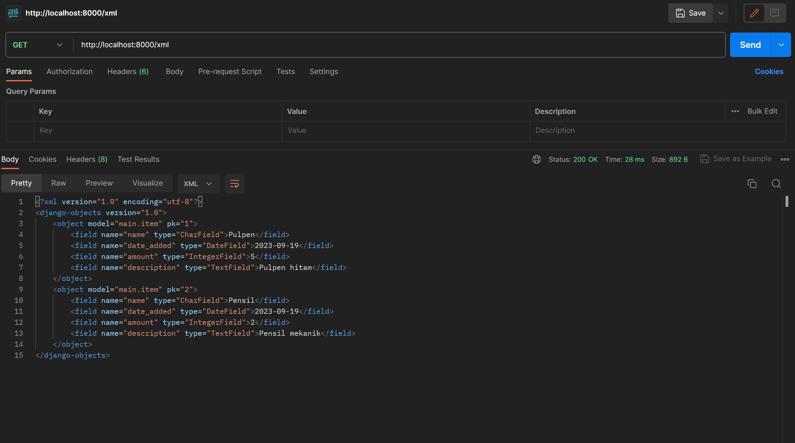

<details>
<summary>Tugas 2</summary>

# Tugas 2 PBP
link hasil deploy aplikasi: https://catalogjocelyn.adaptable.app/

## Cara implementasi step-by-step
### Membuat sebuah proyek Django baru
Pertama-tama, saya memastikan bahwa Django telah terinstall sebelum memulai. Karena sudah terinstall, langkah selanjutnya yang saya lakukan adalah membuat direktori proyek dengan cara membuka terminal lalu memindahkan direktori di mana saya membuat proyek tugas 2 ini. Lalu, saya membuat direktori proyek ini dengan perintah `mkdir tugas_2`. Setelah itu, saya mengaktifkan virtual environment dengan perintah `env\Scripts\activate.bat`. Terakhir, saya membuat proyek Django bernama tugas_2 dengan perintah `django-admin startproject tugas_2 .`

### Membuat aplikasi dengan nama main pada proyek tersebut
Karena saya telah mengaktifkan virtual environment pada langkah sebelumnya, maka saya dapat langsung menjalankan perintah `python manage.py startapp main` untuk membuat aplikasi baru. Setelah perintah ini dijalankan, direktori baru dengan nama `main` yang berisi struktur awal aplikasi akan terbentuk. Selanjutnya, saya menambahkan `main` pada variabel `INSTALLED_APPS` yang berada pada berkas `settings.py` dalam direktori proyek `tugas_2` untuk mendaftarkan aplikasi ini ke dalam proyek tugas_2 ini.

### Melakukan routing pada proyek agar dapat menjalankan aplikasi main
Membuka berkas `urls.py` dalam direktori proyek tugas_2, lalu mengimpor fungsi `include` dari `django.urls`. Setelah itu, routing dilakukan dengan cara menambahkan `path('main/', include('main.urls'))`.

### Membuat model pada aplikasi main dengan nama Item dan memiliki atribut wajib
Aplikasi `main` menggunakan model bernama `Item` dan memiliki atribut `name` dengan tipe `CharField` , `amount` dengan tipe `IntegerField`, dan `description` dengan tipe `TextField`. Pertama-tama saya membuka berkas `models.py` pada direktori aplikasi `main`, lalu mengisi berkas dengan kode:
```
from django.db import models

class Item(models.Model):
    name = models.CharField(max_length=255)
    amount = models.IntegerField()
    description = models.TextField()
```
Setelah mendefinisikan model, saya melakukan migrasi dengan perintah `python manage.py makemigrations` dan menerapkan migrasi ke dalam basis data lokal dengan perintah `python manage.py migrate`.

### Membuat sebuah fungsi pada views.py untuk dikembalikan ke dalam sebuah template HTML yang menampilkan nama aplikasi serta nama dan kelas
Dalam berkas `views.py` pada aplikasi `main`, saya mengimpor fungsi `render` dari modul django.shortcuts dan membuat fungsi view (show_main) dengan parameter request dari user. Setelah itu, main.html akan di-render dan ditambahkan pula context pada pengembalian fungsi render yang dapat dimunculkan pada halaman HTML. Maka dari itu, setelahnya saya membuat berkas `main.html` dalam direktori `templates` di main. Kemudian, untuk memetakan data yang didapatkan ke dalam HTML untuk memetakan data template, saya menggunakan sintaks `{{ name }}` dan `{{ class }}` agar data yang terdapat pada konteks dapat dimapping ke halaman HTML tersebut. 

### Membuat sebuah routing pada urls.py aplikasi main untuk memetakan fungsi yang telah dibuat pada views.py
Pada awalnya, saya membuat berkas `urls.py` dalam direktori `main`. Setelah itu, mengimpor `path` dari `django.urls` dan fungsi `show_main` dari berkas `views` pada direktori `main`. Fungsi `show_main` akan digunakan sebagai tampilan yang akan muncul ketika mengakses URL. Lalu, pada variabel `urlpatterns` akan ditambahkan `path('', show_main, name='show_main')` untuk menjadikan tampilan ini sebagai tampilan default.

### Melakukan deployment ke Adaptable
Membuat aplikasi baru dengan klik `new app`, lalu buat aplikasi baru dengan menghubungkan dengan repository yang sudah dibuat sebelumnya. Setelah itu, saya memilih repository github `tugasPBP` dan branch `main` untuk dideploy. Selanjutnya, pilih `Python App Template` sebagai template deployment dan `PostgreSQL` sebagai tipe basis data yang akan digunakan. Kemudian, masukan versi Python sesuai spesifikasi dan masukkan perintah `python manage.py migrate && gunicorn shopping_list.wsgi` pada bagian `Start Command`. Kemudian, saya memasukkan nama `catalogjocelyn` sebagai nama aplikasi sekaligus nama domain situs web aplikasi yang saya buat. Kemudian, centang bagian `HTTP Listener on PORT` dan terakhir, klik `Deploy App` untuk memulai proses deployment.


## Buatlah bagan yang berisi request client ke web aplikasi berbasis Django beserta responnya dan jelaskan pada bagan tersebut kaitan antara urls.py, views.py, models.py, dan berkas html


Ketika user atau client (web browser) mengirim request ke server melalui URL, Django akan mencocokan URL yang direquest dengan URL yang telah didefinisikan pada berkas `urls.py`. Kemudian, setiap URL akan dipetakan ke fungsi tertentu yang berada pada berkas `views.py` yang akan memanggil fungsi `view` untuk melakukan query terhadap database dengan memanggil objek pada `models.py`sebagai penghubung. Setelah itu,  fungsi view akan mengembalikan respons berupa format HTML, yang merupakan berkas HTML, dan hasil tersebut akan dirender oleh template yang akan menyajikan konten yang akan dilihat oleh user atau client.


## Jelaskan mengapa kita menggunakan virtual environment? Apakah kita tetap dapat membuat aplikasi web berbasis Django tanpa menggunakan virtual environment?
Virtual environment adalah sebuah wadah untuk mengisolasi dependensi proyek atau aplikasi sendiri-sendiri dan memastikan tidak ada konflik antara versi library atau package yang berbeda. Kita perlu menggunakan virtual environment untuk menjaga dependensi yang dibutuhkan oleh proyek atau aplikasi yang berbeda. Misalnya, jika proyek A memerlukan versi 1 dari library X dan proyek B memerlukan versi 2 dari library yang sama. Kita harus mengkondisikan environmentnya sesuai dengan proyek yang ingin kita kembangkan, maka virtual environment berperan di sini untuk dapat membuat dua environment terisolasi dengan versi library yang sesuai untuk masing-masing proyek. Intinya, Virtual environment ini juga berguna untuk memastikan kalau versi dari sebuah library yang digunakan di satu project tidak akan berubah apabila kita melakukan sebuah update di library yang sama di project lain-nya. 

Kita tetap dapat membuat aplikasi web berbasis Django tanpa menggunakan virtual environment. Namun, sangat disarankan menggunakan virtual environment untuk menghindari kekacauan pada satu proyek jika kita melakukan update library yang sama di proyek yang berbeda. Tetapi, jika aplikasi yang ingin dibuat hanya aplikasi yang ingin dibuat hanya aplikasi kecil yang hanya digunakan oleh diri sendiri dan mungkin untuk hanya untuk sementara, maka kita tidak terlalu membutuhkan penggunaan virtual environment.


## Jelaskan apakah itu MVC, MVT, MVVM dan perbedaan dari ketiganya
### MVC (Model-View-Controller)
MVC adalah pola atau konsep arsitektur yang memisahkan aplikasi dalam 3 komponen utama:
* Model: Model dalam MVC berperan untuk mengelola dan berhubungan langsung dengan database
* View: View dalam MVC berperan untuk menyajikan tampilan informasi kepada pengguna
* Controller: Controller pada MVC berperan untuk menghubungkan model dan view dalam setiap proses request dari user.

### MVT (Model-View-Template)
MVT adalah konsep arsitektur yang digunakan dalam kerangka kerja Django untuk pengembangan web.
* Model: Model dalam MVT bertanggung jawab atas logika bisnis dan mengatur data aplikasi. Ini mencakup definisi struktur data dan berinteraksi dengan database atau sumber data lainnya.
* View: View dalam MVT mengendalikan logika presentasi. Ini bertugas untuk menampilkan data dari Model kepada pengguna. Dalam Django, View juga dapat mengatur alur aplikasi dan mengatur tampilan yang akan digunakan.
* Template: Template adalah komponen unik dalam MVT. Komponen ini memisahkan tampilan HTML dari logika aplikasi. Template digunakan untuk merancang tampilan yang akan digunakan untuk menampilkan data dari Model. Template membuat Django sangat cocok untuk pengembangan web karena memungkinkan desainer web untuk bekerja dengan template HTML tanpa harus berurusan dengan kode Python.

### MVVM (Model-View-ViewModel)
Model-View-ViewModel (MVVM) adalah pola arsitektur perangkat lunak yang banyak digunakan dan dirancang khusus untuk menyederhanakan pemisahan masalah antara antarmuka pengguna (UI) dan logika yang mendasarinya. Pola ini memisahkan aplikasi menjadi tiga komponen utama:
* Model: Model dalam MVVM mengelola data dan logika bisnis, mirip dengan MVC dan MVT.
* View: View dalam MVVM menampilkan data kepada pengguna, seperti dalam MVC dan MVT.
* ViewModel: ViewModel adalah komponen unik dalam MVVM. Ini bertindak sebagai penghubung antara Model dan View. ViewModel menerima input dari View mengenai aktivitas pengguna, melakukan data binding dua arah (2-way data binding) antara Model dan View, dan mengubah format data dari Model agar sesuai dengan tampilan yang diperlukan. ViewModel memungkinkan tampilan yang sangat fleksibel dan dinamis.

### Perbedaan Ketiganya
* Dari Segi Penggunaan Umum
  * MVT umumnya digunakan dalam kerangka kerja web Python seperti Django.
  * MVC adalah pola arsitektur yang lebih umum digunakan dalam pengembangan perangkat lunak, tidak terbatas pada web.
  * MVVM umumnya digunakan dalam pengembangan aplikasi berbasis klien, terutama aplikasi web interaktif dan aplikasi seluler.
* Dari Segi Pemisahan Logika Presentasi
  * MVT memisahkan logika presentasi dari logika aplikasi dengan menggunakan Template.
  * MVC memisahkan logika presentasi dari logika aplikasi dengan menggunakan Controller.
  * MVVM memisahkan logika presentasi dari logika aplikasi dengan menggunakan ViewModel yang memungkinkan manipulasi data sebelum ditampilkan dalam View.
* Dari Segi Ketergantungan Alur Aplikasi
  * MVT dalam Django memiliki pengendalian alur aplikasi yang diatur oleh kerangka kerja secara internal, sedangkan MVC memerlukan Controller untuk mengendalikan alur aplikasi.
  * MVVM memiliki fleksibilitas tinggi dalam mengatur alur aplikasi melalui ViewModel yang dapat menghubungkan View dan Model, tetapi tidak memiliki komponen Controller yang eksplisit.
* Dari Segi Fleksibilitas Tampilan
  * MVVM mencapai tingkat fleksibilitas tampilan yang lebih tinggi melalui penggunaan ViewModel, di mana tampilan dapat dengan mudah diubah tanpa mengganggu Model atau data di baliknya.
  * MVT dan MVC memiliki cara yang lebih terbatas dalam mengelola tampilan.


</details>

<details>
<summary>Tugas 3</summary>

# Tugas 3 PBP
## Perbedaan antara form POST dan form GET dalam Django
* POST
  * Lebih aman karena data dikirimkan dalam badan permintaan HTTP sehingga data ini tidak terlihat di URL
  * Panjang string tidak dibatasi
  * Pengambilan variabel dengan request.POST.get
  * Pengiriman data tidak memengaruhi data di server (menambah atau mengubah data di database) sehingga sering digunakan untuk tindakan yang mengubah status, seperti menambahkan data baru
  * Karena keamanannya, sesuai digunakan untuk mengirim data-data penting seperti password
* GET
  * Kurang aman salah satunya karena data dikirimkan melalui URL sebagai query string sehingga berarti data tersebut akan terlihat langsung di URL, yang dapat dilihat oleh banyak pihak
  * Panjang string dibatasi hanya sampai 2047 karakter
  * Pengambilan variabel dengan request.POST.get
  * Pengiriman data umumnya digunakan untuk tindakan yang bersifat membaca dan tidak memengaruhi data di server. Dengan kata lain, mengambil data dari server tanpa memodifikasi data.
  * Karena sifatnya yang kurang aman, maka sesuai digunakan untuk mengirim data-data tidak penting 


## Perbedaan utama antara XML, JSON, dan HTML dalam konteks pengiriman data
XML (eXtensible Markup Language), JSON (JavaScript Object Notation), dan HTML (HyperText Markup Language) adalah tiga format yang umum digunakan untuk pengiriman data dalam konteks berbeda. Berikut adalah perbedaan utama antara ketiganya:

### Struktur dan Tujuan:
* XML (eXtensible Markup Language): XML adalah bahasa markup yang dirancang untuk menyimpan dan mengirim data terstruktur. Ini adalah format umum yang digunakan dalam pertukaran data antara aplikasi dan platform yang berbeda.
* JSON (JavaScript Object Notation): JSON adalah format pertukaran data yang ringan dan mudah dibaca yang digunakan terutama untuk pertukaran data antara aplikasi web dan server. Ini memiliki sintaksis yang lebih sederhana dan mudah digunakan oleh bahasa pemrograman modern.
* HTML (HyperText Markup Language): HTML adalah bahasa markup yang digunakan untuk membuat halaman web. Ini digunakan untuk menentukan struktur dan tampilan halaman web, bukan untuk pertukaran data dalam format mentah seperti XML dan JSON.

### Sintaksis:
* XML: XML menggunakan sintaksis yang ketat dengan tag yang dikelilingi oleh tanda kurung siku `<tag></tag>` dan mendefinisikan struktur data dengan jelas menggunakan Dokumen Tipe (DTD) atau Skema XML.
* JSON: JSON menggunakan sintaksis yang lebih ringkas dan sederhana. Data dalam JSON dibungkus dalam pasangan nama-nilai, yang dipisahkan oleh tanda titik dua (key: value). Ini membuatnya mudah dibaca oleh manusia dan mudah diproses oleh mesin.
* HTML: HTML juga memiliki sintaksisnya sendiri yang digunakan untuk menggambarkan elemen-elemen dalam halaman web, termasuk tag seperti `<p>, <div>, <a>, dll`.

### Tipe Data yang Didukung:
* XML: XML mendukung berbagai jenis tipe data, termasuk teks, angka, tanggal, dan tipe data yang didefinisikan oleh pengguna melalui skema XML.
* JSON: JSON mendukung tipe data dasar seperti string, angka, boolean, objek, array, dan nilai-nilai null.
* HTML: HTML tidak berfungsi sebagai format pertukaran data; sebaliknya, itu adalah bahasa yang digunakan untuk menggambarkan tampilan dan struktur halaman web.

### Penggunaan Umum:
* XML: XML digunakan pada banyak aplikasi web maupun mobile, yaitu untuk menyimpan dan mengirimkan data.
* JSON: JSON digunakan pada banyak aplikasi web modern maupun mobile, yaitu untuk menyimpan dan mengirimkan data. Sintaks JSON merupakan turunan dari Object JavaScript. Akan tetapi format JSON berbentuk text, sehingga kode untuk membaca dan membuat JSON banyak terdapat di banyak bahasa pemrograman.
* HTML: HTML digunakan untuk membuat halaman web dan menggambarkan struktur dan konten halaman.

### Pemrosesan:
* XML: Parsing XML memerlukan lebih banyak upaya karena sintaksis yang lebih rumit.
* JSON:  Parsing JSON lebih mudah dan lebih cepat karena sintaksis yang sederhana.
* HTML: Parsing HTML digunakan untuk merender halaman web dan memerlukan pemrosesan yang berbeda dari XML atau JSON.

### Kecepatan:
* XML: XML seringkali lebih lambat dalam pertukaran data dibandingkan dengan JSON atau HTML. Ini karena XML memiliki sintaksis yang lebih kompleks, dan parsing XML memerlukan lebih banyak waktu dan sumber daya.
* JSON: JSON umumnya lebih cepat dalam pertukaran data dibandingkan dengan XML karena sintaksis yang lebih sederhana dan mudah diproses.
* HTML:  HTML digunakan untuk membuat tampilan dan struktur halaman web, bukan untuk pertukaran data dalam format mentah seperti XML atau JSON. Kecepatan dalam konteks HTML terutama terkait dengan bagaimana halaman web itu sendiri dirancang dan diunggah oleh server ke klien.


## Alasan JSON sering digunakan dalam pertukaran data antara aplikasi web modern
Alasan utamanya adalah terkait dengan keringanan, kesederhanaan, dan kompatibilitasnya.
* Keringanan (Lightweight):
  * JSON adalah format data yang sangat ringan. Ini berarti bahwa data dalam format JSON memiliki ukuran file yang kecil sehingga memungkinkan untuk ditransmisikan melalui jaringan dengan cepat dan efisien.
  * Keringanan ini mengurangi beban bandwidth dan waktu yang dibutuhkan untuk mengirim data JSON antara aplikasi web, yang merupakan aspek kunci dalam kinerja dan responsivitas aplikasi modern.
  * Pengolahan JSON juga memerlukan sedikit sumber daya komputasi sehingga aplikasi yang memproses data JSON dapat berjalan dengan cepat dan efisien.

* Kesederhanaan (Simplicity):
  * JSON didesain dengan sederhana dan mudah dibaca oleh manusia. Data dalam JSON diatur dalam pasangan "nama-nilai" yang jelas dan intuitif, menjadikannya format data yang mudah dimengerti oleh developer dan bahkan oleh manusia yang melihatnya.
  * Kesederhanaan ini membuat JSON cocok untuk pertukaran data yang perlu dianalisis atau dimodifikasi oleh manusia dan juga memudahkan pengembang dalam mengelola dan memahami data yang digunakan dalam aplikasi.

* Kompatibilitas:
  * JSON sangat kompatibel dengan berbagai bahasa pemrograman. Hampir semua bahasa pemrograman modern memiliki dukungan untuk mengurai dan menghasilkan data JSON yang memungkinkan aplikasi yang ditulis dalam bahasa yang berbeda-beda untuk berkomunikasi dengan mudah melalui JSON.
  * Selain itu, JSON adalah format yang sangat kompatibel dengan JavaScript, yang adalah bahasa pemrograman yang sangat umum digunakan dalam pengembangan web. Ini membuat JSON menjadi pilihan yang ideal untuk pengembangan aplikasi web di mana JavaScript digunakan di sisi klien.


## Pengimplementasian checklist di atas secara step-by-step
### Membuat input form untuk menambahkan objek model pada app sebelumnya
Untuk membuat input form, kita perlu membuat berkas baru bernama `forms.py` pada direktori `main`. Pertama-tama kita dapat mengimport `ModelForm` dari `django.forms` dan `Item` dari `main.models`. Langkah selanjutnya adalah membuat Class Formulir berdasarkan nama yang diinginkan dan kelas ini merupakan turunan dari `ModelForm`. Selanjutnya, kita dapat menentukan model yang digunakan oleh form, misalnya pada tugas kali ini atribut dalam item yang disertakan dalam form adalah `name, amount, description`. Lalu, kita akan melakukan import `HttpResponseRedirect`, `ItemForm`, dan `reverse` pada berkas `views.py` dalam direktori `main`. Dalam berkas ini pula, kita akan membuat fungsi baru bernama `create_item` yang digunakan untuk menghasilkan formulir yang dapat menambahkan data item secara otomatis ketika disubmit dari form. Contoh penerapan fungsi `create_item` adalah sebagai berikut:
```
def create_item(request):
    form = ItemForm(request.POST or None)

    if form.is_valid() and request.method == "POST":
        form.save()
        return HttpResponseRedirect(reverse('main:show_main'))

    context = {'form': form}
    return render(request, "create_item.html", context)
```

Pada fungsi `show_main` dalam `views.py` perlu ditambahkan fungsi `items = Item.objects.all()` untuk mengambil seluruh objek Item yang tersimpan dalam database. Selanjutnya, fungsi `show_main` dan `create_item` tersebut diimport pada `urls.py` sehingga dapat diakses dengan menambahkan path url ke dalam `urlspatterns` pada `urls.py` di `main`. Setelah itu, perlu membuat berkas HTML bernama `create_item.html` pada `main/templates` untuk menampilkan halaman form. Terakhir, kita dapat menggunakan `main.html` untuk menampilkan data produk yang telah diinput serta tombol yang akan menuju ke halaman form.

### Menambahkan 5 fungsi views untuk melihat objek yang sudah ditambahkan dalam format HTML, XML, JSON, XML by ID, dan JSON by ID
Langkah yang perlu dilakukan adalah dengan membuka berkas `views.py` pada folder main dan meng-import `HttpResponse` dan `Serializer`, lalu membuat 5 fungsi berbeda untuk melihat objek dengan kelima format yang menerima parameter request (request dan id untuk format XML by ID dan JSON by ID) dan dalam fungsi tersebut terdapat variabel yang digunakan untuk menampung hasil query seluruh data yang ada pada `Item`. Untuk format XML by ID dan JSON by ID, hasil query seluruh data pada `Item` di-filter berdasarkan idnya. Fungsi tersebut akan me-return HttpResponse yang berisi parameter data hasil query yang sudah diserialisasi menjadi kelima format tersebut serta parameter `content_type="application/[namaformat]”`. 
```
def show_main(request):
    items = Item.objects.all()
    
    context = {
        'name': 'Jocelyn',
        'class': 'PBP D',
        'items': items,
        'item_count': items.count(),  # Menambah item_count ke dalam konteks
    }

    return render(request, "main.html", context)

def show_xml(request):
    data = Item.objects.all()
    return HttpResponse(serializers.serialize("xml", data), content_type="application/xml")

def show_json(request):
    data = Item.objects.all()
    return HttpResponse(serializers.serialize("json", data), content_type="application/json")

def show_xml_by_id(request, id):
    data = Item.objects.filter(pk=id)
    return HttpResponse(serializers.serialize("xml", data), content_type="application/xml")

def show_json_by_id(request, id):
    data = Item.objects.filter(pk=id)
    return HttpResponse(serializers.serialize("json", data), content_type="application/json")

```

### Membuat routing URL untuk masing-masing views yang telah ditambahkan pada poin 2
Setelah membuat kelima fungsi tersebut, pada berkas `urls.py` di folder main akan ditambahkan import terhadap fungsi-fungsi yang tadi telah dibuat pada `views.py`. Selanjutnya, untuk mengakses fungsi yang telah di-import tadi ditambahkan path url ke dalam `urlpatterns`.
```
from django.urls import path
from main.views import show_main, create_item, show_xml, show_json, show_xml_by_id, show_json_by_id 

app_name = 'main'

urlpatterns = [
    path('', show_main, name='show_main'),
    path('create-item', create_item, name='create_item'),
    path('xml/', show_xml, name='show_xml'), 
    path('json/', show_json, name='show_json'), 
    path('xml/<int:id>/', show_xml_by_id, name='show_xml_by_id'),
    path('json/<int:id>/', show_json_by_id, name='show_json_by_id'),
]
```


## Screenshot hasil akses URL pada Postman
### HTML


### XML


### JSON


### XML by ID


### JSON by ID


</details>

<details>
<summary>Tugas 4</summary>

# Tugas 4 PBP
## Apa itu Django UserCreationForm, dan jelaskan apa kelebihan dan kekurangannya?
UserCreationForm adalah salah satu bentuk dari built-in forms dari Django yang dirancang khusus untuk membuat dan mendaftarkan pengguna baru dalam aplikasi web yang dibangun menggunakan Django. Django UserCreationForm menyediakan serangkaian bidang dan validasi bawaan yang memudahkan penggunaan proses pendaftaran pengguna dalam aplikasi yang dibuat sehingga pengguna baru dapat mendaftar dengan mudah di situs web kita tanpa harus menulis kode dari awal.
* Kelebihan
  * Mudah dalam Penggunaan
  UserCreationForm sudah memiliki bidang standar yang umumnya digunakan dalam pendaftaran pengguna seperti username dan password. Hal ini membuatnya mudah digunakan tanpa perlu menulis kode form dari awal.
  * Validasi Otomatis
  Form ini memiliki validasi otomatis untuk memastikan data yang dimasukkan oleh pengguna sesuai dengan aturan yang ditentukan, seperti memeriksa apakah username sudah digunakan atau password memiliki tingkat keamanan yang cukup.
  * Kustomisasi
  Kita dapat menyesuaikan UserCreationForm sesuai kebutuhan aplikasi dengan menambahkan atau menghapus bidang atau  membuat subclass untuk mengubah perilakunya.
* Kekurangan
  * Desain Tampilan Terbatas
   UserCreationForm tidak memiliki tampilan atau antarmuka pengguna yang sudah dibuat, jadi jika ingin membuat tampilan lebih menarik, kita perlu membuat tampilan pendaftaran pengguna sendiri yang membutuhkan waktu dan usaha tambahan.


## Apa perbedaan antara autentikasi dan otorisasi dalam konteks Django, dan mengapa keduanya penting?
Autentikasi adalah proses verifikasi pengguna yang hendak mengakses sebuah sumber daya web (sistem, server, dan lain sebagainya). Autentikasi biasanya melibatkan validasi terhadap kredensial pengguna, seperti nama pengguna dan password. Autentikasi penting untuk melindungi informasi sensitif dan mencegah akses yang tidak sah ke akun pengguna. Sedangkan otorisasi adalah proses identifikasi apakah pengguna memiliki akses terhadap suatu sumber daya atau tidak. Maka dari itu, autentikasi dilakukan sebelum otorisasi. Keduanya penting karena kombinasi autentikasi dan otorisasi memungkinkan pemilik sumber daya untuk mengelola tingkat keamanan dan akses dalam aplikasi kita, mengontrol siapa yang dapat melakukan apa, dan melindungi data dan sumber daya dari akses yang tidak sah.


## Apa itu cookies dalam konteks aplikasi web, dan bagaimana Django menggunakan cookies untuk mengelola data sesi pengguna?
Cookie adalah sejumlah kecil informasi yang dikirim oleh server web ke browser dan kemudian dikirim kembali oleh browser pada page request selanjutnya. Cookie bersifat sementara. Cookie digunakan dalam konteks aplikasi web untuk menyimpan informasi di sisi klien (pada perangkat pengguna) yang dapat digunakan oleh server web untuk mengenali dan mengidentifikasi pengguna kembali saat mereka berinteraksi dengan situs atau aplikasi yang sama. Cookie dapat digunakan untuk berbagai tujuan, salah satunya adalah mengelola data sesi pengguna. 

Ketika pengguna pertama kali berinteraksi dengan aplikasi web Django, server akan mengirimkan cookie ke browser pengguna melalui header HTTP. Cookie ini berisi informasi yang digunakan oleh server untuk mengenali dan mengelola sesi pengguna. Cookie yang dikirimkan oleh server mengandung informasi seperti ID sesi pengguna. ID ini menghubungkan browser pengguna dengan data sesi yang disimpan di server, yang biasanya disimpan dalam database, cache, atau tempat penyimpanan lainnya. Browser pengguna menyimpan cookie ini, dan setiap kali pengguna membuat permintaan berikutnya ke aplikasi web yang sama, cookie tersebut akan disertakan dalam header permintaan HTTP. Ini memungkinkan server untuk mengidentifikasi pengguna berdasarkan ID sesi yang disimpan dalam cookie. Cookie memiliki beberapa atribut, termasuk nama dan nilai (data yang disimpan), domain website, path pada domain tersebut, tanggal kedaluwarsa, ukuran cookie, dan lainnya.


## Apakah penggunaan cookies aman secara default dalam pengembangan web, atau apakah ada risiko potensial yang harus diwaspadai?
Karena cookies disimpan di sisi klien, keamanan sepenuhnya tergantung pada tindakan pengguna. Cookies dapat dengan mudah dilihat oleh pengguna melalui peramban web mereka, sehingga data sensitif sebaiknya tidak disimpan di dalamnya. Karena sifat terbuka cookies, mereka bisa disalin dan direplikasi dengan mudah, meningkatkan risiko serangan yang dikenal sebagai "cookie stealing" yang dapat digunakan untuk menipu server dengan relatif mudah.


## Pengimplementasian checklist di atas secara step-by-step
### Membuat Halaman Registrasi
Kita akan membuat template html dengan nama `register.html` dan pada berkas ini kita isi dengan kode untuk tampilan halaman pendaftaran pengguna. Kurang lebih implementasinya adalah sebagai berikut
```



    <title>Register</title>


  

<div class = "login">
    
    <h1>Register</h1>  

        <form method="POST" >  
              
            <table>  
                {{ form.as_table }}  
                <tr>  
                    <td></td>
                    <td><input type="submit" name="submit" value="Daftar"/></td>  
                </tr>  
            </table>  
        </form>

      
        <ul>   
              
                <li>{{ message }}</li>  
                  
        </ul>   
    

</div>  


```

### Membuat Halaman Login
Pada Django, template login form tidak tersedia sehingga kita perlu mengimplementasikannya sendiri. Berikut adalah contoh isi berkas `login.html` yang saya gunakan:
```



    <title>Login</title>




<div class = "login">

    <h1>Login</h1>

    <form method="POST" action="">
        
        <table>
            <tr>
                <td>Username: </td>
                <td><input type="text" name="username" placeholder="Username" class="form-control"></td>
            </tr>
                    
            <tr>
                <td>Password: </td>
                <td><input type="password" name="password" placeholder="Password" class="form-control"></td>
            </tr>

            <tr>
                <td></td>
                <td><input class="btn login_btn" type="submit" value="Login"></td>
            </tr>
        </table>
    </form>

    
        <ul>
            
                <li>{{ message }}</li>
            
        </ul>
         
        
    Don't have an account yet? <a href="">Register Now</a>

</div>


```
Pada `views.py`, kita akan mengimplementasian autentikasi pengguna berdasarkan username dan password yang diterima dari request yang dikirim pengguna saat login. Kita dapat menggunakan interface Django `authenticate` untuk mengimplementasikannya. Berikut adalah fungsi login yang saya gunakan
```
def login_user(request):
    if request.method == 'POST':
        username = request.POST.get('username')
        password = request.POST.get('password')
        user = authenticate(request, username=username, password=password)
        if user is not None:
            login(request, user)
            return redirect('main:show_main')
        else:
            messages.info(request, 'Sorry, incorrect username or password. Please try again.')
    context = {}
    return render(request, 'login.html', context)
```
Setelah itu, kita ingin membatasi agar hanya user yang login yang dapat mengakses halaman utama. Caranya adalah dengan menggunakan decorator `login_required`. Misalnya seperti ini
```
@login_required(login_url='/login')
def main(request: HttpRequest):
    ...
```

### Membuat Fungsi Logout
Membuat fitur logout dengan pertama-tama membuat tombol `Logout` pada berkas `main.html`. Berikut adalah contoh implementasinya
```
...
<a href="">
    <button>
        Logout
    </button>
</a>
...
```
Selanjutnya, kita membuat fungsi logout yang akan akhiri sesi pengguna yang saat ini masuk dan menghapus cookie dengan nama `last_login` dari respons yang akan dikirimkan ke browser pengguna dan mengarahkan pengguna ke halaman login setelah berhasil logout. Berikut contoh implementasinya
```
def logout_user(request):
    logout(request)
    response = HttpResponseRedirect(reverse('main:login'))
    response.delete_cookie('last_login')
    return response
```

### Menghubungkan Models dengan User
Untuk menghubungkan Models dengan User, kita perlu menggunakan `ForeignKey` agar sebuah produk diasosiasikan hanya dengan seorang user. Implementasinya adalah sebagai berikut
```
class Item(models.Model):
    user = models.ForeignKey(User, on_delete=models.CASCADE)
    ...
```
Selanjutnya, kita perlu mengassign user terkait saat pembuatan object item. Implementasinya pada fungsi `create_item` adalah sebagai berikut
```
def create_item(request):
    form = ItemForm(request.POST or None)

    if form.is_valid() and request.method == "POST":
        item = form.save(commit=False)
        item.user = request.user
        item.save()
        return HttpResponseRedirect(reverse('main:show_main'))

    context = {'form': form}
    return render(request, "create_item.html", context)
```
Dan untuk menampilkan objek item yang terasosiasikan dengan pengguna yang sedang login, kita perlu menyaring seluruh objek dan hanya mengambil `Item` di mana field `user` terisi dengan objek `User` yang sama dengan pengguna yang sedang login. Implementasinya adalah sebagai berikut
```
def show_main(request):
    items = Item.objects.filter(user=request.user)
    ...
```


### Membuat Cookie Informasi Last Login
Kita mengambil nilai cookie dengan menambahkan `last_login = request.COOKIES['last_login']` pada `context`. Implementasi cookie informasi last login kurang lebih implementasinya sebagai berikut 
```
def login_user(request):
    if request.method == 'POST':
        username = request.POST.get('username')
        password = request.POST.get('password')
        user = authenticate(request, username=username, password=password)
        
        if user is not None:
            login(request, user)
            response = HttpResponseRedirect(reverse("main:show_main")) 
            response.set_cookie('last_login', str(datetime.datetime.now()))
            return response
        else:
            messages.info(request, 'Sorry, incorrect username or password. Please try again.')
            ...
```


### Bonus: button tambah, button kurang, button hapus
Pertama-tama kita perlu menambahkan button tambah, button kurang, dan button hapus pada berkas `main.html`. Implementasinya adalah sebagai berikut
```
<td align="center">
    <div style="display: inline-block;">
        <form method="post" action="">
            
            <button type="submit">Tambah</button>
        </form>
    </div>
    <div style="display: inline-block;">
        <form method="post" action="">
            
            <button type="submit">Kurang</button>
        </form>
    </div>
    <div style="display: inline-block;">
        <form method="post" action="">
            
            <button type="submit">Hapus</button>
        </form>
    </div>
</td>
```
Button tersebut akan mengarah ke fungsi `add_amount`, `min_amount`, dan `remove_item` dengan parameter request dan id. Id adalah id item yang akan diubah. Berikut adalah implementasi fungsi `add_amount`, `min_amount`, dan `remove_item`.
```
@login_required(login_url='/login')
def add_amount(request, id):
    if request.method == 'POST':
        item = Item.objects.filter(user=request.user, pk=id).first()
        if item:
            item.amount += 1
            item.save()
    return redirect('main:show_main')

@login_required(login_url='/login')
def min_amount(request, id):
    if request.method == 'POST':
        item = Item.objects.filter(user=request.user, pk=id).first()
        if item:
            if (item.amount == 0):
                item.amount == 0
            else:
                item.amount -= 1
            item.save()
    return redirect('main:show_main')

@login_required(login_url='/login')
def remove_item(request, id):
    if request.method == 'POST':
        item = Item.objects.filter(user=request.user, pk=id).first()
        if item:
            item.delete()
    return redirect('main:show_main')
```

</details>


<details>
<summary>Tugas 5</summary>

# Tugas 5 PBP
## Jelaskan bagaimana cara kamu mengimplementasikan checklist di atas secara step-by-step (bukan hanya sekadar mengikuti tutorial).
Untuk mengimplementasikan kustomisasi pada tugas kali ini, saya menggunakan framework Bootstrap.
## Halaman Login

Pada halaman login, saya menggunakan class `login-container`, `card`, `card-header`, dan lain sebagainya. Untuk mengkustomisasi warna header, letak, padding, border, dan lainnya, saya mendefinisikannya dalam tag `<style>`seperti berikut ini:
```
<style>
    body, html {
        height: 100%;
        margin: 0;
        background-color: #f0f0f0;
        display: flex;
        justify-content: center;
        align-items: center;
    }

    .login-container {
        width: 50vw;
        height: 100vh
        max-width: 100%; 
        padding: 20px;
        border-radius: 10px;
        background-color: #ffffff;
        box-shadow: 0 0 10px rgba(0, 0, 0, 0.1);
    }

    .card-header {
        font-size: 1.5em;
    }

</style>
```
Lalu, saya juga menambahkan icon login untuk membuatnya lebih menarik dengan sintaks berikut ``

## Halaman Register

Pada halaman register, secara garis besar, saya mengkustomisasinya dengan mengatur peletakan container dan pewarnaan header. Saya mengkreasikannya dengan mendefinisikannya dalam tag `<style>`seperti berikut ini:
```
<style>
    body, html {
        height: 100%;
        margin: 0;
        background-color: #f0f0f0;
        display: flex;
        justify-content: center;
        align-items: center;
    }
    .card-header {
        font-size: 1.5em;
    }
</style>
```

## Halaman Main

Pada halaman daftar inventori, saya membuat beberapa class. Misalnya ada class container, card, header-color, card-header, dan sebagainya. Saya melakukan kustomisasi dengan mendefinisikannya dalam tag `<style>`seperti berikut ini:
```
<style>    
    .header-color {
        background-color: #007bff;
        color: white;
    }

    .card-header {
        font-size: 1.5em;
    }
    
    .card {
        margin-top: 50px;
        box-shadow: 0 4px 8px 0 rgba(0,0,0,0.2);
        transition: 0.3s;
    }
    
</style>
```
Lalu, untuk mengkreasikan button `Tambah`, saya menambahkan sintaks `class="btn btn-success`, untuk button `Kurang` dengan sintaks `class="btn btn-warning"`, dan untuk button `Hapus` dengan sintaks `btn btn-danger`.

## Halaman Tambah Inventori

Pada halaman tambah inventori, saya mengkustomisasinya dengan memberikan warna pada header card, menyesuaikan letaknya, serta mengatur margin. Untuk mengatur tata letak elemen pada halaman, saya menggunakan class `container`, `row`, dan `col-md-6`.


## Jelaskan manfaat dari setiap element selector dan kapan waktu yang tepat untuk menggunakannya
1. Element Selector
Selector elemen digunakan untuk memilih semua elemen yang memiliki tag HTML tertentu, cocok untuk memberikan gaya umum pada elemen tersebut di seluruh halaman web. Contoh:
```
p {
    color: blue;
}
```
2. ID Selector
ID Selector memungkinkan developer memilih elemen dengan atribut `id` tertentu di dalam HTML sehingga cocok penerapan gaya atau fungsionalitas khusus pada elemen tertentu di halaman web. Contoh:
```
#header {
    font-size: 24px;
}
```
3. Class Selector
Class Selector memungkinkan developer untuk memilih elemen-elemen yang memiliki atribut `class` tertentu di dalam HTML sehingga ideal untuk memilih elemen tertentu yang memiliki karakteristik atau fungsi yang sama, memungkinkan penerapan gaya yang seragam pada elemen-elemen tersebut. Contoh:
```
.button {
    background-color: green;
}
```


## Jelaskan HTML5 Tag yang kamu ketahui.
* `<div>`: Elemen blok umum yang digunakan untuk mengelompokkan elemen-elemen HTML dan menerapkan CSS atau skrip ke kelompok tersebut.
* ``: Menyisipkan gambar ke dalam halaman web.
* `<audio>`: Menyisipkan file audio ke dalam halaman web.
* `<canvas>`: Memungkinkan gambar dan grafik untuk digambar melalui JavaScript.
* `<video>`: Menyisipkan video ke dalam halaman web.


## Jelaskan perbedaan antara margin dan padding.
Margin adalah area kosong di sisi luar dari elemen HTML. Margin berfungsi untuk mengatur jarak antara suatu elemen dengan elemen lainnya pada HTML. Sedangkan padding merupakan ruang kosong yang berada pada sisi dalam sebuah elemen HTML. Padding berfungsi untuk memberikan jarak antara sebuah elemen dan elemen lainnya yang berada di dalam tag tersebut. Berikut adalah ilustrasi perbedaannya.


## Jelaskan perbedaan antara framework CSS Tailwind dan Bootstrap. Kapan sebaiknya kita menggunakan Bootstrap daripada Tailwind, dan sebaliknya?
Perbedaan utama antara framework Tailwind dan Bootstrap terletak pada pendekatan yang digunakan. Tailwind bukanlah kit UI yang sudah jadi dan siap pakai, berbeda dengan Bootstrap yang sudah memiliki template khusus. 

Maka dari itu, Bootstrap adalah pilihan ideal jika website diperlukan dalam waktu cepat dan ingin mengejar efisiensi waktu. Dengan komponen-komponen siap pakai dan desain bawaan yang responsif, Bootstrap memungkinkan pengembangan cepat tanpa kehilangan kualitas sehingga sangat efektif ketika proyek website memiliki batas waktu yang ketat dan memerlukan antarmuka yang terlihat baik dengan waktu implementasi yang singkat.

Sementara itu, Tailwind menawarkan fleksibilitas yang tinggi, akan tetapi membutuhkan waktu lebih lama untuk menggunakannya dengan maksimal. Hal ini karena pengembang perlu membangun antarmuka dari nol dengan menggabungkan kelas-kelas utilitas yang mungkin memerlukan lebih banyak waktu daripada menggunakan Bootstrap. Namun, dalam jangka panjang, Tailwind memungkinkan pengembang membuat desain yang lebih kreatif dan unik sesuai kebutuhan proyek.


</details> 